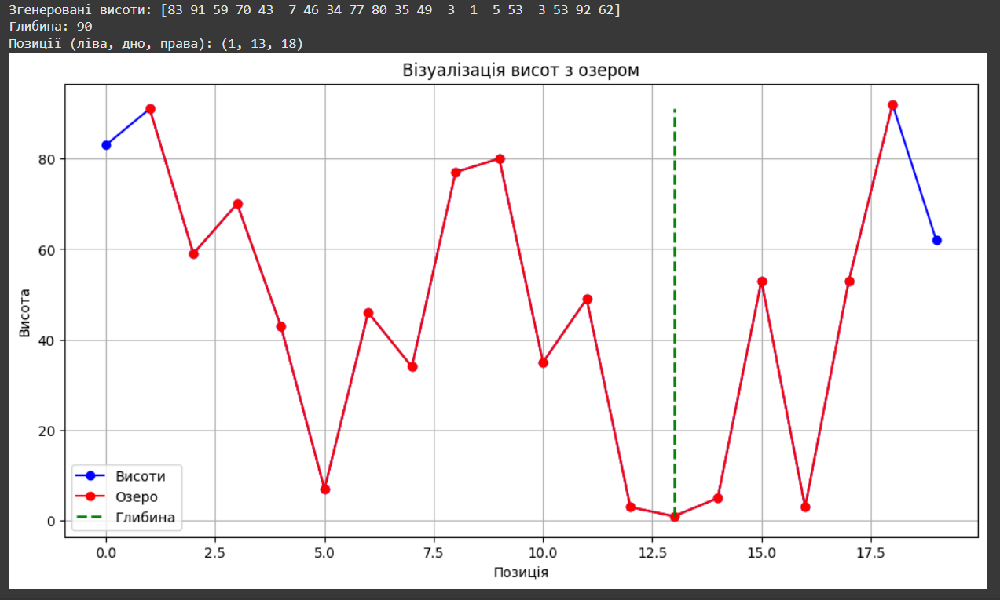
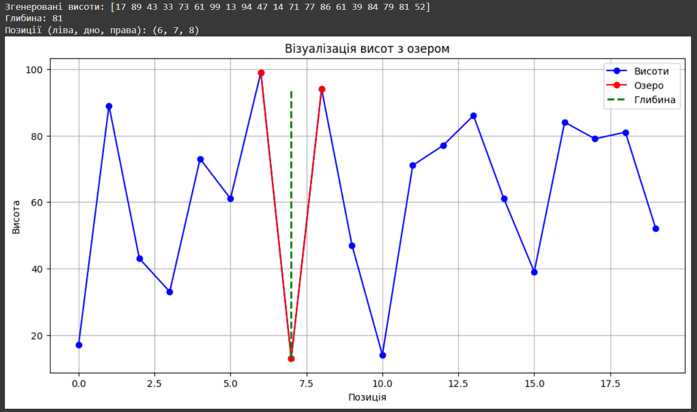

# Illya-BOICHUK-test_tasks_Camp_2025

# Звіт по виконанню завдання Data Science Camp 2025

## Task 1

### Опис роботи
В даному коді було використано такі бібліотеки `import numpy as np` для роботи з масивами та математичними функціями, `import matplotlib.pyplot as plt` для візуалізації даних

#### 1. Функція пошуку озера `find_lake`
Функція `find_lake` використовує вкладені цикли для перебору всіх можливих комбінацій лівої та правої "стінки" потенційного озера,перебирає всі можливі позиції для лівої стінки (`l`) від 0 до `n-3`, для кожної лівої стінки перебирає всі можливі позиції для правої стінки (`r`) починаючи з `l+2` до `n-1`. Вимога `l+2` гарантує, що між стінками є хоча б одна точка для "озера"

Для кожної пари стінок (l, r) виконуються такі перевірки:
1. Рівень води в озері визначається висотою нижчої з двох стінок: `wall_h = min(h[l], h[r])`
2. `mid_h = h[l+1:r]` — всі висоти між лівою та правою стінкою
3. `if max(mid_h) < wall_h` — перевіряє, чи всі проміжні точки мають висоту меншу за нижчу стінку
      - Якщо хоча б одна проміжна точка вища або рівна `wall_h`, це не озеро
4. Пошук найнижчої точки озера: 
      - `min_h = min(mid_h)` — висота найнижчої точки
      - `min_idx = l + 1 + np.argmin(mid_h)` — індекс найнижчої точки (зсунутий на `l+1`, оскільки `argmin` повертає індекс відносно підмасиву `mid_h`)
5. `depth = wall_h - min_h` — різниця між рівнем води та найнижчою точкою озера
6. Якщо поточне озеро глибше за попереднє найглибше, зберігаємо його параметри

#### 2. Візуалізація результатів `plot_h`
Функція `plot_h` створює графічне представлення рельєфу та знайденого озера:

1. `plt.figure(figsize=(12, 6))` — створює полотно для графіка заданого розміру
2. Синя лінія з маркерами представляє весь рельєф
3. `if lake`, виконується додаткова візуалізація:
      - Ділянка рельєфу, що представляє озеро (від лівої до правої стінки), виділяється червоним кольором
      - Розраховується рівень води: `wall_h = min(h[l], h[r])`
      - Малюється зелена пунктирна вертикальна лінія від дна озера до рівня води, що показує глибину
4. Додаються підписи осей, заголовок, сітка та легенда

Цей алгоритм має часову складність O(n³), де n — кількість точок висоти, оскільки включає вкладені цикли та додаткові операції пошуку мінімуму/максимуму в підмасивах.

### Представлення роботи програми

**Результат №1**

**Результат №1**
