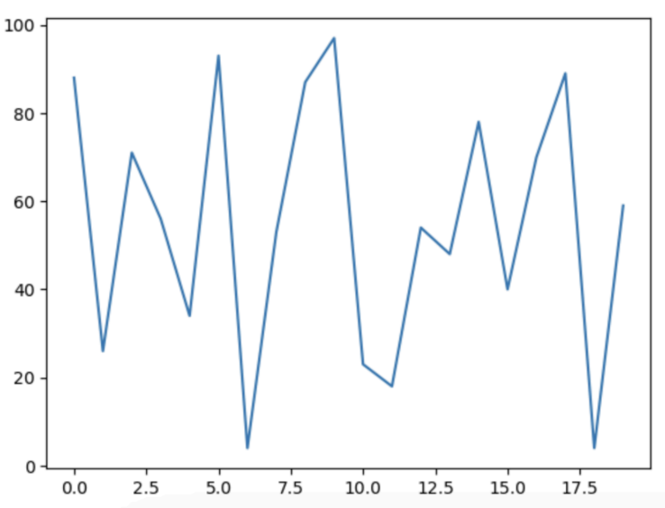
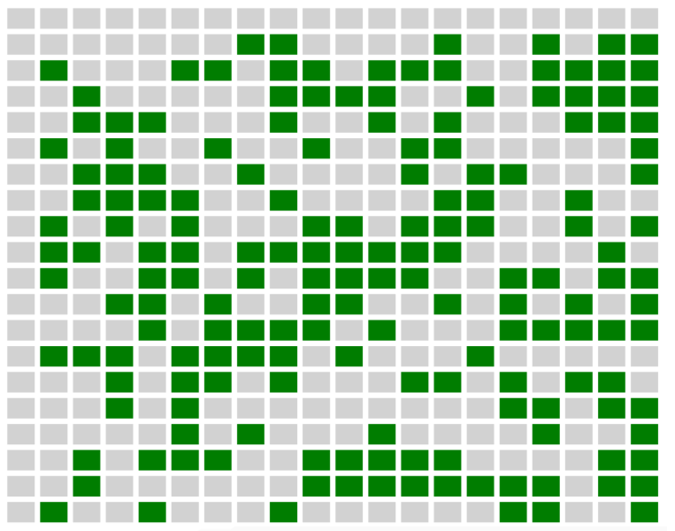
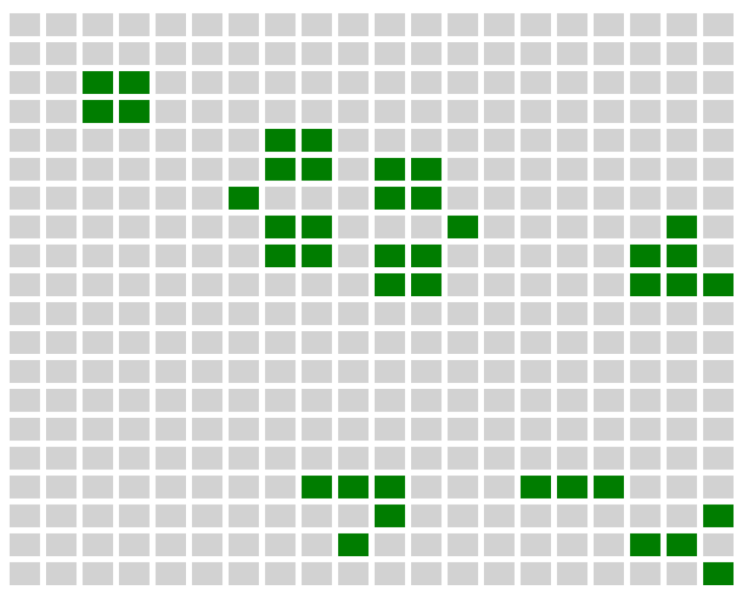

# Illya-BOICHUK-Camp-2025

## Data Science Camp 2025

## Test Tasks

### Task 1
Generate the sequence of 20 random integer values from 0 to 100.
Build the plot that joins each neighbour's values as shown on the image for
`[88, 26, 71, 56, 34, 93, 4, 53, 87, 97, 23, 18, 54, 48, 78, 40, 70, 89, 4, 59]`

Consider the values as the heights of 2d mountains on which the rain falls
from above. Those subsequences that have larger values on boundaries
form the lakes.

1) Develop the function that accepts the list of provided 20 integer
values and calculates the depth of the deepest lake. Considering the 
above example, the response should be 89 which is the depth of the
lake formed by subsequence `[93, 4, 53, 87, 97]`.

2) Visualize the values as heights and highlight the deepest lake.

**Response format:**
Programming code in jupyter notebook/colab/etc. containing the following:
1) Generating list of 20 random values,
2) Function that calculates the depth of deepest lake
3) Visualization

### Task 2

Consider the matrix of size 20 x 20 filled randomly with binary values 0
(cell is “dead”) or `1` (cell is “alive”).
The following image represents the sample where green cells are 1 and
grey ones are 0:

1) Develop the algorithm that accepts the specified binary array of size
20x20 and iterates the steps where each step executes the following
rules:
  - If a living cell has two or three living neighbors, it remains alive;
  - if a living cell has one or no living neighbors, it dies of
"loneliness";
  - if a living cell has four or more living neighbors, it dies from
"overpopulation";
  - if a dead cell has exactly three living neighbors, it comes to life.

2) (Optionally) visualize the process of execution steps.
The following image represents the result after 20 steps for the mentioned
above initialization.

**Response format:**
Programming code in jupyter notebook/colab/etc. containing the following:
1) Generating the matrix of size 20x20 with binary random values
2) Algorithm that executes iterations over rules
3) Matrix of values after 20 executed steps
4) (Optionally) visualization of results over iteration process

### Task 3

The probability of outcome `H` (‘Head’) at flipping each of the 5 coins (call
them m1, m2, m3, m4, m5) with a changed center of gravity equal `[0.8, 0.9, 0.1, 0.2, 0.3]` respectively. One of the coins was chosen at random and the
tests began. Determine the probability of `H` in the next flip after `9` of the
actual tests: `[H T H H H T T H H]` (here `T`(‘Tail’) is opposite side of the
coin).

For example, before the first test, the probability of `H` is `0.46` (according to
the formula of full probability, taking into account the equivalence of the
choice of one of the available coins). After the flip of `H` in the first test, the
probability of the hypothesis that the selected coin is m3 / m4 / m5
decreased, and probabilities of hypothesis that m1 / m2, increased
compared to initial `0.2` probability for each coin.

Therefore, the probability to flip `H` in the next test now equals to `~ 0.69`.
Similarly, after the evidence of `T` in the next test, you need to re-compute
the probability of flipping `H` in the third flip, etc.

**Response format:**
  - list of probabilities to the nearest hundredth `[0.69,?,? ,?,?,?,?,?,?]`
(replace ‘?’ with the appropriate values)
  - Program code, or description