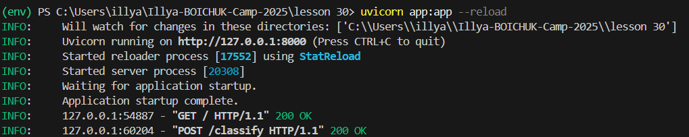
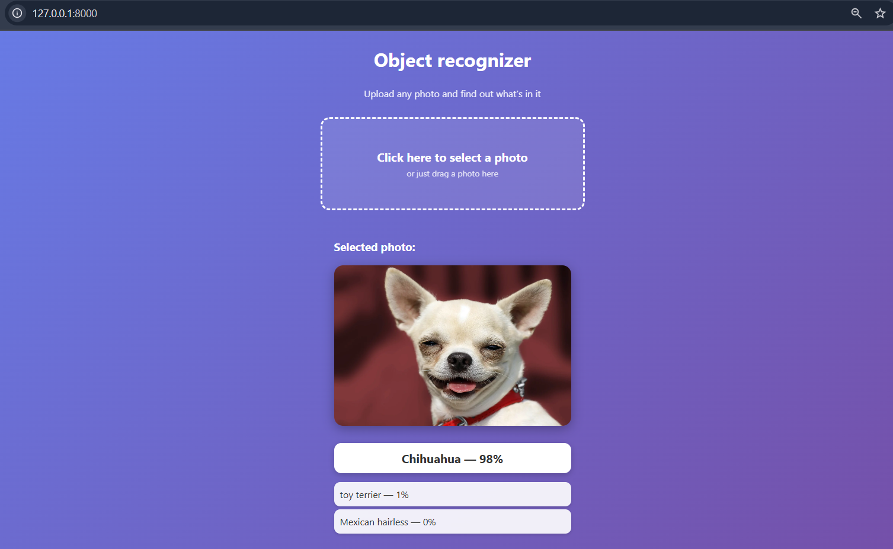

# Illya-BOICHUK-Camp-2025

## Overview

This homework assignment demonstrates the implementation of a web application for recognizing objects in photographs. The user uploads a photo via the web interface, the service processes it using the google/vit-base-patch16-224 model, and returns the top 3 classifications with probabilities.

## Deployment Info

The application is implemented on FastAPI. The server is launched via Uvicorn on the local host 127.0.0.1:8000 with the ability to auto-reload during development. The model is loaded once when the server starts. JPG, PNG, and WEBP image formats are supported, with a maximum file size limit of 5 MB.

## Installation Instruction

Clone the project repository and navigate to its folder. It is recommended to create a virtual environment with the command `python -m venv venv` and activate it with `env\Scripts\activate`. Install dependencies with `pip install -r requirements.txt`. To start the service, use the command `uvicorn app:app --reload`.

The requirements.txt file includes all the necessary tools to run the model.

## Modeling Info

The `google/vit-base-patch16-224` model from Hugging Face is a Vision Transformer designed for image classification. It expects RGB images as input, with a maximum size of 1024x1024 pixels and a file size not exceeding 5 MB. The model splits the image into patches, processes them through a transformer, and outputs the probabilities of belonging to different classes. The output returns the three most probable classes for each image along with a score, a number from 0 to 1 that shows the model's confidence. In the code, we take the top 3 results and round the score to four decimal places for ease of display.

## Interface Description

The web interface is accessible via a GET request to `/`. It displays a page with an area for uploading photos, a preview of the selected image, and a block for displaying classification results. The user can select a file or drag it into the upload area, after which a request is sent to the API for analysis.

A POST request to `/classify` accepts image files in JPG, PNG, or WEBP formats. The API checks the file size and processes it through the `google/vit-base-patch16-224` model. The response returns JSON with a `results` field containing an array of objects, where each object has a `label` and a `score` rounded to 4 digits.

A GET request to `/health` returns the system status, including the status `“healthy”`, the `model_loaded` flag indicating whether the model is available, and the API version. For example, the response might look like this: `{“status”:“healthy”,“model_loaded”:true,‘version’:“2.0.0”}`.

## Example of Processes

The image shows what the logs look like.

After starting the server, a log appears: `INFO: Application startup complete.`
The web page is open: `INFO: 127.0.0.1:61324 - "GET / HTTP/1.1" 200 OK`.
When uploading a photo, a POST request is sent to `/classify`: `INFO: 127.0.0.1:50855 - "POST /classify HTTP/1.1" 200 OK`.
The preliminary JSON response contains the top 3 predictions, for example: `{"results":[{"label":"golden_retriever","score":0.9721},{"label":"Labrador_retriever","score":0.0231},{"label":"beagle","score":0.0048}]}`.

The following image shows how the web interface works, where a photo of a dog was presented, and the photo was of very good quality, which influenced the probability of the model being confident in its answer.

